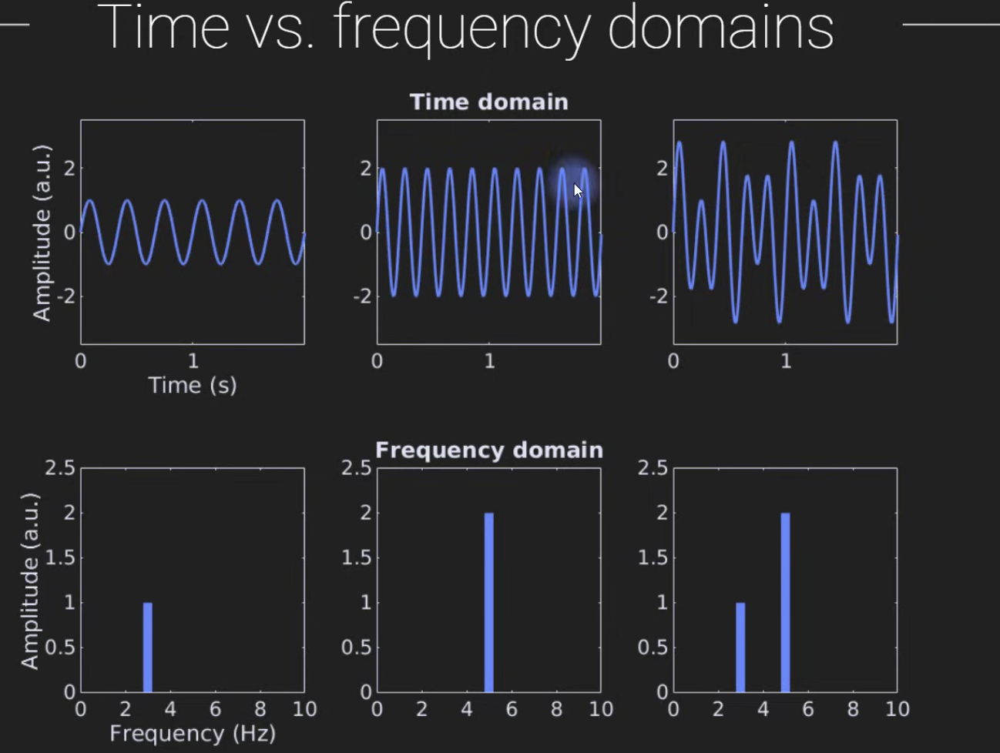

### Setup and Test the MicroMusicGPT Baseline

### Break down the architecture of ACE-Step 1.5 DiT VAE

* Understand the Model Architecture
* Understand the difference between the Continuous VAE Audio Latents from the ACE-Step 1.5 Model and the MIDI Latents in our baseline MicroMusicGPT model

#### How the AutoEncoder process the Audio Inputs

- Original ACE-Step 1.0 Model --> ***2D Mel-spectrograms*** passed directly through a ***DCAE (Deep Convolutional AutoEncoder)***
- ACE-Step 1.5 Model --> ***1D Variational AutoEncoder (VAE) over pure waveform-domain***, raw 48KHz stereo audio.
- 

